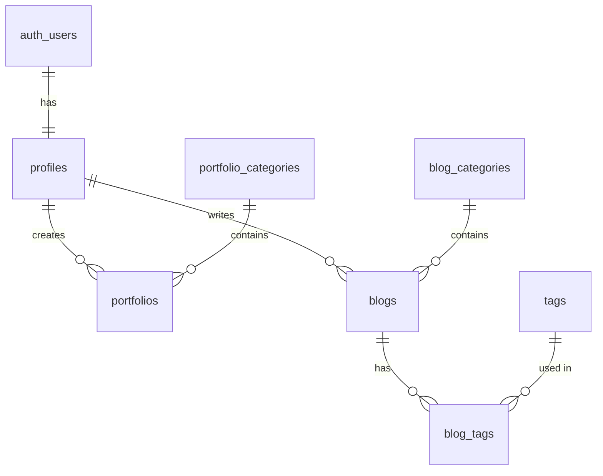

# Design Blueprint: IM Tech Company Profile

**Version:** 1.0  
**Generated:** 2026-01-15  
**Status:** ✅ Ready for Development  
**Phase Completed:** Design Phase

---

## Quick Summary

| Aspect | Value |
|--------|-------|
| **Project** | IM Tech Company Profile + Admin Dashboard |
| **Type** | Corporate Website + CMS |
| **Team** | 7 members (part-time) |
| **Timeline** | 1 month (flexible) |
| **ADRs** | 3 |
| **Tables** | 11 |
| **Endpoints** | 58 |
| **Screens** | 21 |
| **User Stories** | 33 (87 points) |

---

## Table of Contents

1. [Project Overview](#1-project-overview)
2. [Tech Stack](#2-tech-stack)
3. [Architecture](#3-architecture)
4. [Database Design](#4-database-design)
5. [API Design](#5-api-design)
6. [UI/UX Design](#6-uiux-design)
7. [Security](#7-security)
8. [Development Handoff](#8-development-handoff)
9. [Appendix](#appendix)

---

## 1. Project Overview

### 1.1 Problem Statement

IM Tech adalah software house yang belum memiliki kehadiran digital. Potential clients dari sektor B2G (Pemerintah) dan B2B (Bisnis) kesulitan memverifikasi kredibilitas perusahaan tanpa website resmi yang menampilkan legalitas, portfolio, dan informasi kontak.

### 1.2 Solution

Membangun **Company Profile Website** yang profesional dengan fitur:
- **Landing Page** — Showcase company, services, portfolio, blog, team
- **Admin Dashboard** — CMS untuk mengelola semua konten

### 1.3 Scope

#### In Scope ✅

**Landing Page (8 Pages)**
- Homepage dengan hero, about preview, services, portfolio preview
- About page dengan company info dan legality
- Services page
- Portfolio page dengan filter kategori
- Blog page
- Team page
- Contact page dengan form dan WhatsApp integration

**Admin Dashboard (8 Features)**
- Authentication (login, logout, session)
- Portfolio CRUD
- Blog CRUD dengan rich text editor
- Team CRUD
- Services CRUD
- Contact submissions viewer
- Multi-user management (Admin, Editor, Viewer)

#### Out of Scope ❌

- E-commerce / payment processing
- Multi-language (Phase 2+)
- Mobile app native
- Real-time chat
- Analytics dashboard
- Email marketing integration

### 1.4 Success Metrics

| Metric | Target | Measurement |
|--------|--------|-------------|
| Website Live | Week 4 | Deployed on Vercel |
| Portfolio Items | ≥ 5 | Initial content |
| Contact Form Working | 100% | Test submissions |
| Page Load Time | < 3s | Lighthouse |
| Mobile Responsive | 100% | Device testing |

---

## 2. Tech Stack

### 2.1 Core Technologies

| Category | Technology | Version | Rationale |
|----------|------------|---------|-----------|
| **Language** | TypeScript | 5.x | Type safety, fewer bugs |
| **Framework** | Next.js | 16 LTS | SSG/ISR for landing, SSR for admin |
| **Styling** | Tailwind CSS | v4 | Latest features, utility-first |
| **UI Components** | shadcn/ui | Latest | Accessible, customizable |
| **Database** | Supabase PostgreSQL | - | Free tier, RLS, real-time ready |
| **Auth** | Supabase Auth | - | JWT, integrated |
| **Storage** | Supabase Storage | - | Image uploads |
| **Hosting** | Vercel | - | Next.js optimized, free tier |

### 2.2 Development Tools

| Category | Tool | Purpose |
|----------|------|---------|
| **Linting** | ESLint + Prettier | Code consistency |
| **Testing** | Vitest | Unit tests |
| **E2E Testing** | Playwright | Browser testing |
| **Git Hooks** | Husky + lint-staged | Pre-commit checks |
| **CI/CD** | GitHub Actions | Automated deployment |

### 2.3 Key Dependencies

```json
{
  "dependencies": {
    "next": "^16.0.0",
    "@supabase/supabase-js": "^2.x",
    "@supabase/ssr": "^0.x",
    "tailwindcss": "^4.x",
    "zod": "^3.x",
    "@tiptap/react": "^2.x"
  }
}
```

---

## 3. Architecture

### 3.1 Pattern: Layered Architecture

> **ADR-001:** Layered Architecture selected for simplicity and fast MVP development.

```
┌──────────────────────────────────────┐
│         PRESENTATION LAYER           │
│   (React Components, Pages, UI)      │
├──────────────────────────────────────┤
│          APPLICATION LAYER           │
│   (API Routes, Server Actions)       │
├──────────────────────────────────────┤
│           SERVICE LAYER              │
│   (Business Logic, Use Cases)        │
├──────────────────────────────────────┤
│         DATA ACCESS LAYER            │
│   (Supabase Client, Repositories)    │
├──────────────────────────────────────┤
│          DATABASE LAYER              │
│   (Supabase PostgreSQL + Storage)    │
└──────────────────────────────────────┘
```

### 3.2 ADR Summary

| ADR | Title | Status | Key Decision |
|-----|-------|--------|--------------|
| ADR-001 | Architecture Pattern | ✅ Accepted | Layered Architecture |
| ADR-002 | Database Design | ✅ Accepted | Supabase PostgreSQL + RLS |
| ADR-003 | API Design | ✅ Accepted | REST API with versioning |

### 3.3 Folder Structure

```
im-tech-company-profile/
├── src/
│   ├── app/                    # Next.js App Router
│   │   ├── (landing)/          # Public pages
│   │   ├── (admin)/            # Dashboard (protected)
│   │   ├── (auth)/             # Auth pages
│   │   └── api/v1/             # API Routes
│   ├── components/             # React Components
│   │   ├── ui/                 # shadcn/ui
│   │   ├── landing/            # Landing-specific
│   │   ├── admin/              # Dashboard-specific
│   │   └── shared/             # Shared components
│   ├── services/               # Business Logic
│   ├── repositories/           # Data Access
│   ├── lib/                    # Utilities
│   │   └── supabase/           # Supabase clients
│   ├── types/                  # TypeScript types
│   ├── validations/            # Zod schemas
│   └── hooks/                  # Custom hooks
├── supabase/
│   └── migrations/             # SQL migrations
├── public/                     # Static assets
└── tests/                      # Test files
```

---

## 4. Database Design

### 4.1 Entity-Relationship Diagram



### 4.2 Tables Summary

| Table | Purpose | Key Fields |
|-------|---------|------------|
| `profiles` | User profiles + roles | id, name, role, is_active |
| `portfolio_categories` | Portfolio categories | id, name, slug |
| `portfolios` | Project showcase | id, title, slug, images, status |
| `blog_categories` | Blog categories | id, name, slug |
| `blogs` | Blog posts | id, title, slug, content, status |
| `tags` | Blog tags | id, name, slug |
| `blog_tags` | Many-to-many | blog_id, tag_id |
| `team_members` | Team profiles | id, name, role, photo_url |
| `services` | Company services | id, title, description |
| `contacts` | Contact submissions | id, name, email, message, status |

### 4.3 Key Indexes

| Table | Column | Index Type |
|-------|--------|------------|
| portfolios | category_id | B-Tree FK |
| portfolios | slug | B-Tree Unique |
| blogs | author_id | B-Tree FK |
| blogs | slug | B-Tree Unique |
| contacts | status | B-Tree |

### 4.4 Migration File

**Location:** `supabase/migrations/20260115_initial_schema.sql`

---

## 5. API Design

### 5.1 Configuration

| Setting | Value |
|---------|-------|
| **Base Path** | `/api/v1` |
| **Auth** | Bearer Token (Supabase JWT) |
| **Format** | JSON with envelope |

### 5.2 Response Envelope

```typescript
// Success
{ "data": T, "meta": { ... } }

// Error
{ "error": { "code": "ERROR_CODE", "message": "...", "details": [...] } }
```

### 5.3 Endpoints Summary

| Group | Public | Admin | Total |
|-------|--------|-------|-------|
| Auth | 4 | 0 | 4 |
| Portfolios | 3 | 5 | 8 |
| Blogs | 3 | 5 | 8 |
| Team | 1 | 5 | 6 |
| Services | 1 | 4 | 5 |
| Contacts | 1 | 4 | 5 |
| Users | 0 | 5 | 5 |
| Upload | 0 | 2 | 2 |
| **Total** | **16** | **42** | **58** |

### 5.4 Key Endpoints

**Public:**
- `GET /api/v1/portfolios` — List published portfolios
- `GET /api/v1/blogs` — List published blogs
- `POST /api/v1/contacts` — Submit contact form

**Admin:**
- `POST /api/v1/auth/login` — Admin login
- `POST /api/v1/admin/portfolios` — Create portfolio
- `PATCH /api/v1/admin/blogs/:id` — Update blog

### 5.5 OpenAPI Spec

**Location:** `openapi.yaml` (900+ lines)

---

## 6. UI/UX Design

### 6.1 Design Style

| Aspect | Decision |
|--------|----------|
| **Style** | Modern Minimalist |
| **Primary Color** | `#0066ff` |
| **Font** | Inter |
| **Approach** | Mobile-first |
| **Components** | shadcn/ui |

### 6.2 Screen Inventory

**Landing Page (9 screens)**
- Homepage, About, Services, Portfolio List/Detail, Blog List/Detail, Team, Contact

**Admin Dashboard (12 screens)**
- Login, Dashboard, Portfolio CRUD, Blog CRUD, Team, Services, Contacts, Users

### 6.3 Design Tokens

**Location:** `design-tokens.json`

| Category | Examples |
|----------|----------|
| Colors | Primary: `#0066ff`, Neutral: `#111827-#f9fafb` |
| Typography | Font: Inter, Sizes: 0.75rem-3.75rem |
| Spacing | 4px base, scale: 4-96px |
| Radius | sm-2xl (2-16px) |
| Shadows | sm-xl (subtle) |

### 6.4 Accessibility (WCAG AA)

- ✅ Color contrast 4.5:1 for text
- ✅ Keyboard navigable
- ✅ ARIA labels on interactive elements
- ✅ Form labels associated
- ✅ Skip to content link

---

## 7. Security

### 7.1 Authentication

| Aspect | Implementation |
|--------|----------------|
| **Method** | Supabase Auth (JWT) |
| **Session** | 24 hour expiry |
| **Storage** | HttpOnly, Secure, SameSite cookies |

### 7.2 Authorization (RBAC)

| Role | Permissions |
|------|-------------|
| **Admin** | Full access, delete, user management |
| **Editor** | Create/update content, no delete |
| **Viewer** | Read only (dashboard) |

### 7.3 Row Level Security (RLS)

All tables have RLS enabled with policies:
- Public: Read published content only
- Authenticated: Read all, write based on role
- Admin: Delete and user management

### 7.4 Security Headers

```http
X-Content-Type-Options: nosniff
X-Frame-Options: DENY
Content-Security-Policy: default-src 'self'
```

### 7.5 Rate Limiting

| Type | Limit |
|------|-------|
| Public | 60 req/min |
| Authenticated | 200 req/min |
| Contact form | 5/hour per IP |

---

## 8. Development Handoff

### 8.1 Quick Start

```bash
# 1. Clone repository
git clone https://github.com/imtech/company-profile.git
cd company-profile

# 2. Install dependencies
npm install

# 3. Setup environment
cp .env.example .env.local
# Fill in Supabase credentials

# 4. Run development
npm run dev
```

### 8.2 Environment Variables

```bash
# Supabase
NEXT_PUBLIC_SUPABASE_URL=
NEXT_PUBLIC_SUPABASE_ANON_KEY=
SUPABASE_SERVICE_ROLE_KEY=

# App
NEXT_PUBLIC_SITE_URL=http://localhost:3000
NEXT_PUBLIC_WHATSAPP_NUMBER=628xxxxxxxxx
```

### 8.3 Sprint 1 Tasks (Week 1-2)

| Priority | Task | Owner |
|----------|------|-------|
| P0 | Setup project structure | Fachri |
| P0 | Configure Supabase + migrations | Mifdal |
| P0 | Implement auth flow | Mifdal |
| P0 | Landing page layout + navigation | Fachri |
| P0 | Homepage components | Fachri |
| P0 | Contact form with WhatsApp | Fachri |
| P0 | Admin dashboard layout | Fachri |
| P0 | Portfolio CRUD | Mifdal + Fachri |

### 8.4 Sprint 2 Tasks (Week 3-4)

| Priority | Task | Owner |
|----------|------|-------|
| P1 | Blog CRUD + rich text editor | Fachri |
| P1 | Team CRUD | Fachri |
| P1 | Services CRUD | Fachri |
| P0 | Contact submissions viewer | Mifdal |
| P0 | User management | Mifdal |
| P1 | Content population | Raffi |
| P1 | Testing + bug fixes | Mifdal |
| P0 | Production deployment | Mifdal |

---

## Appendix

### A. File References

| Document | Path | Description |
|----------|------|-------------|
| SRS | `design_srs.md` | 30 FRs, 11 NFRs |
| User Stories | `design_user_stories.md` | 33 stories, 87 points |
| Personas | `personas/persona_summary.md` | 5 personas |
| ERD | `design_database_erd.md` | Full schema |
| API Design | `design_api.md` | 58 endpoints |
| OpenAPI | `openapi.yaml` | OpenAPI 3.0 spec |
| UI/UX | `design_ui_ux.md` | 21 screens |
| Design Tokens | `design-tokens.json` | All tokens |
| C4 Diagrams | `design_c4_diagrams.md` | Architecture diagrams |
| ADR-001 | `ADR/ADR-001_architecture.md` | Architecture decision |
| ADR-002 | `ADR/ADR-002_database.md` | Database decision |
| ADR-003 | `ADR/ADR-003_api.md` | API decision |
| Migration | `migrations/20260115_initial_schema.sql` | SQL schema |

### B. Planning Phase Reference

| Document | Path |
|----------|------|
| Planning Blueprint | `../Planning/IMTechCompanyProfile/planning_blueprint.md` |
| Project Charter | `../Planning/IMTechCompanyProfile/planning_project_charter.md` |
| Tech Decision | `../Planning/IMTechCompanyProfile/planning_tech_decision.md` |
| RACI Matrix | `../Planning/IMTechCompanyProfile/planning_raci_matrix.md` |
| Risk Register | `../Planning/IMTechCompanyProfile/planning_risk_register.md` |

### C. External Resources

| Resource | URL |
|----------|-----|
| Next.js 16 Docs | https://nextjs.org/docs |
| Supabase Docs | https://supabase.com/docs |
| Tailwind CSS v4 | https://tailwindcss.com |
| shadcn/ui | https://ui.shadcn.com |

---

## ✅ Design Phase Completion Checklist

- [x] SRS document created (30 FRs, 11 NFRs)
- [x] User personas defined (5 personas)
- [x] User stories written (33 stories, 87 points)
- [x] Architecture selected (Layered, ADR-001)
- [x] C4 diagrams created (L1, L2)
- [x] Database designed (11 tables, ADR-002)
- [x] API designed (58 endpoints, ADR-003)
- [x] OpenAPI spec generated
- [x] UI/UX designed (21 screens)
- [x] Design tokens defined
- [x] Accessibility requirements documented
- [x] Design blueprint compiled

---

## 🚀 Next Phase: Development

**Ready to start coding!**

Entry points:
1. `/git-init` — Initialize git repository
2. Setup Next.js 16 + Tailwind v4
3. Configure Supabase project
4. Apply database migrations
5. Start Sprint 1 tasks

---

*Generated: 2026-01-15 14:22*  
*Workflow: /compile-design-blueprint | ID: WF-SPEC07*
