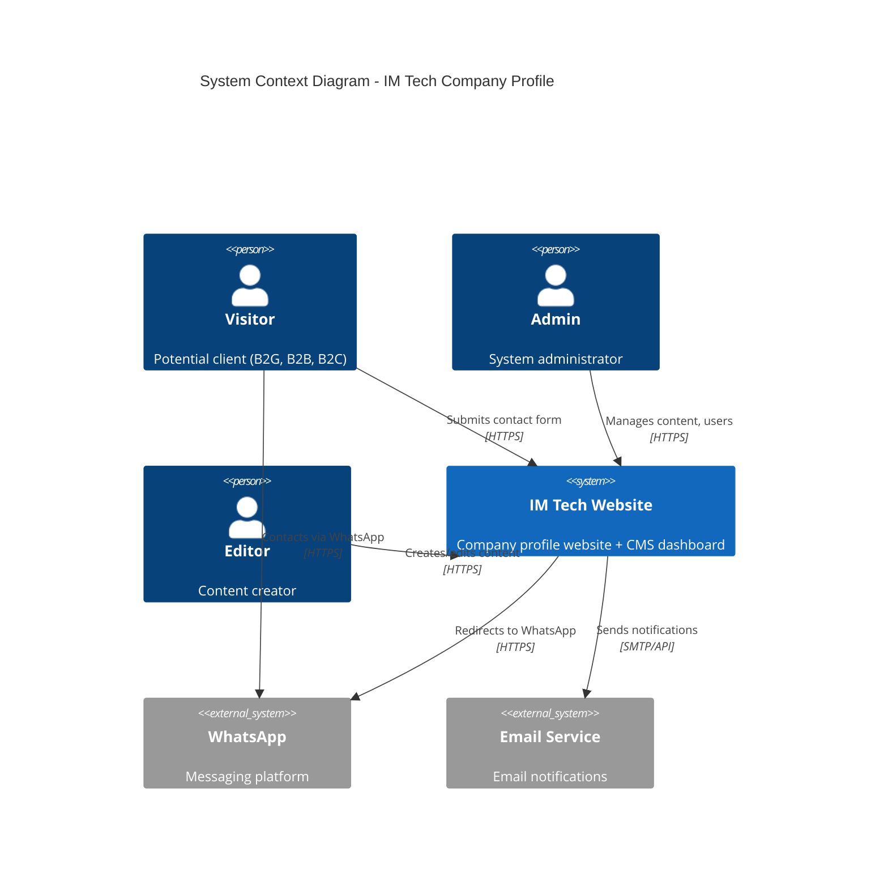
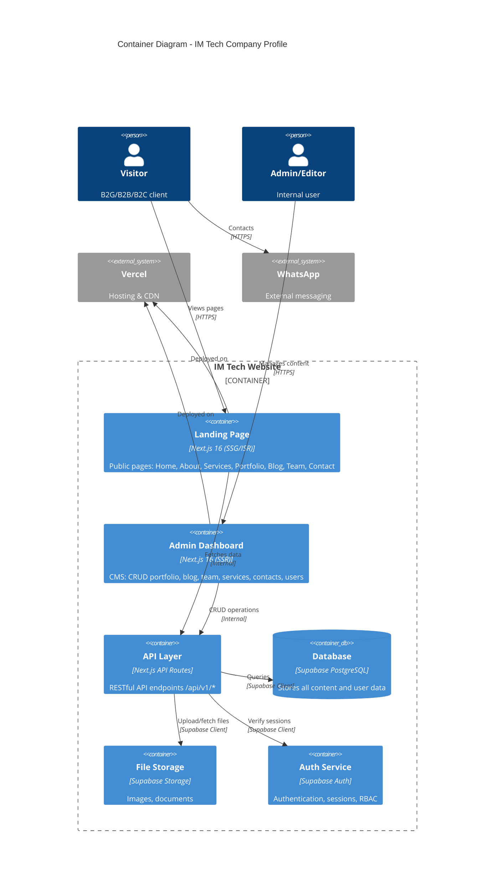
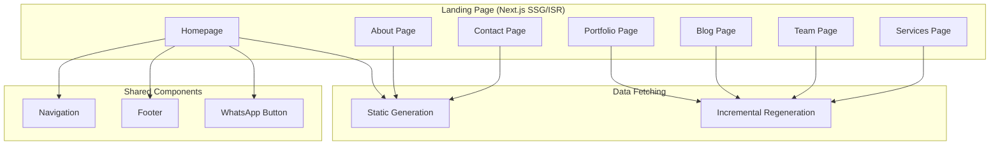
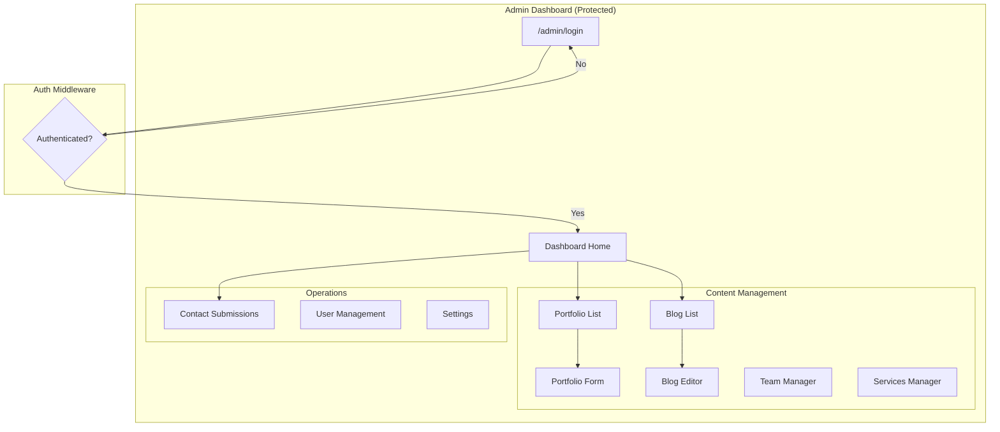
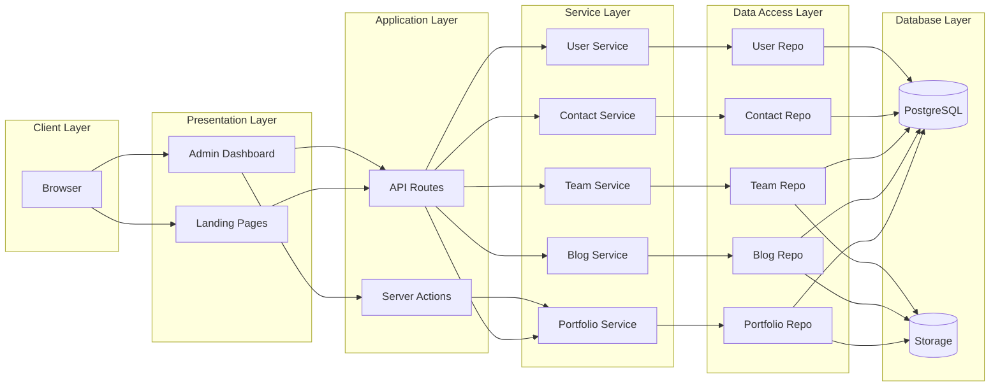
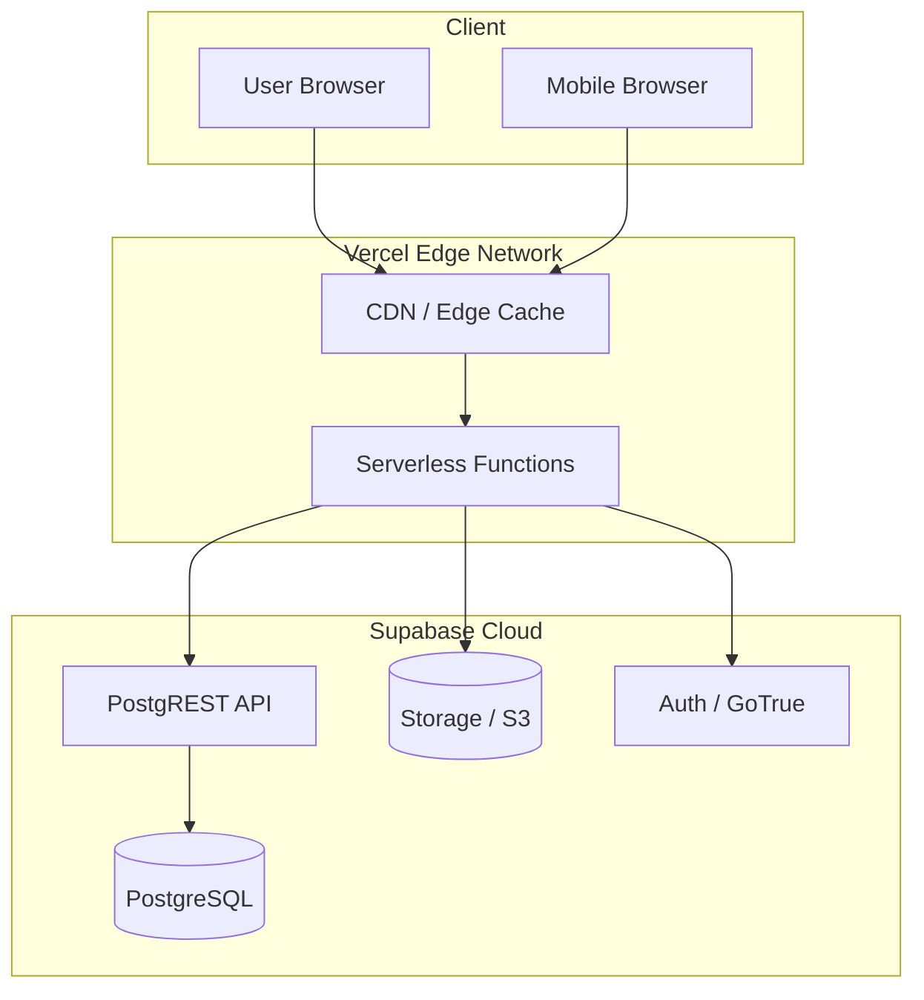
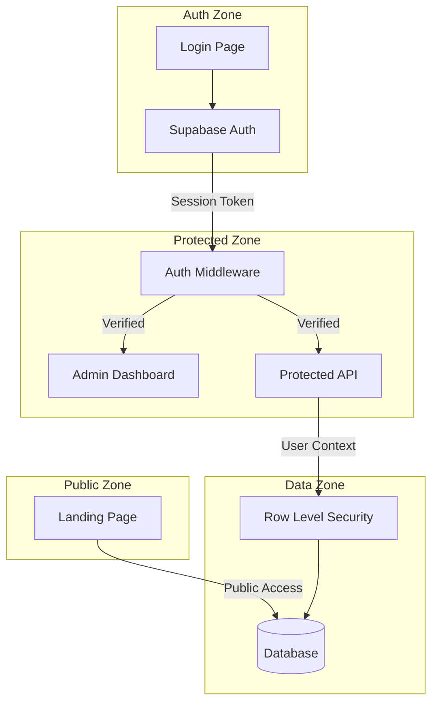

# C4 Architecture Diagrams - IM Tech Company Profile

**Project:** IM Tech Company Profile + Admin Dashboard  
**Date:** 2026-01-15  
**Architecture:** Layered Architecture

---

## Level 1: System Context Diagram

### System Context Description

| Actor | Description | Interaction |
|-------|-------------|-------------|
| **Visitor** | Potential clients (Pak Budi B2G, Ibu Ratna B2B) | Browse landing page, submit contact form, click WhatsApp |
| **Admin** | Pa Heri, Tataq | Full system access, user management |
| **Editor** | Raffi | Content creation (blog, portfolio) |
| **IM Tech Website** | Main system | Serves landing page + admin dashboard |
| **WhatsApp** | External | Direct messaging channel |
| **Email Service** | External (optional) | Contact form notifications |

---

## Level 2: Container Diagram

### Container Descriptions

| Container | Technology | Responsibility |
|-----------|------------|----------------|
| **Landing Page** | Next.js 16 (SSG/ISR) | Public-facing pages, SEO optimized, static generation |
| **Admin Dashboard** | Next.js 16 (SSR) | Protected CMS, dynamic content management |
| **API Layer** | Next.js API Routes | RESTful endpoints, business logic delegation |
| **Database** | Supabase PostgreSQL | Data persistence, RLS for security |
| **File Storage** | Supabase Storage | Images, PDFs, uploads |
| **Auth Service** | Supabase Auth | User authentication, session management |

---

## Level 2: Detailed Component Flow

### Landing Page Container

### Admin Dashboard Container

---

## Level 2: Data Flow Diagram

---

## Deployment Architecture

### Deployment Details

| Component | Service | Tier |
|-----------|---------|------|
| **Frontend** | Vercel | Free (Hobby) |
| **Database** | Supabase | Free (500MB) |
| **Storage** | Supabase | Free (1GB) |
| **Auth** | Supabase | Free (50K MAU) |
| **CDN** | Vercel Edge | Included |

---

## Security Architecture

### Security Layers

| Layer | Mechanism |
|-------|-----------|
| **Transport** | HTTPS everywhere |
| **Authentication** | Supabase Auth (JWT) |
| **Authorization** | Role-Based (Admin, Editor, Viewer) |
| **Data** | Row Level Security (RLS) |
| **Input** | Zod validation |
| **Session** | HttpOnly, Secure, SameSite cookies |

---

## Summary

### Architecture Decisions

| Decision | Choice | Rationale |
|----------|--------|-----------|
| **Pattern** | Layered Architecture | Simple, fast for MVP |
| **Rendering** | SSG + ISR + SSR | SEO for landing, dynamic for admin |
| **Database** | Supabase PostgreSQL | Free, managed, RLS |
| **Auth** | Supabase Auth | Built-in, secure |
| **Hosting** | Vercel | Next.js optimized |

### Key Benefits

1. ✅ Clear separation of concerns
2. ✅ Easy to understand for team
3. ✅ Cost-effective (all free tier)
4. ✅ Scalable for MVP scope
5. ✅ Secure by default

---

*Generated: 2026-01-15*  
*Related: ADR-001_architecture.md*
