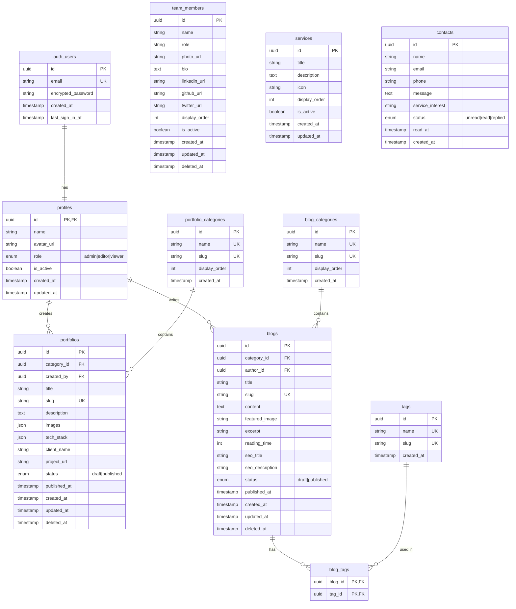

# Database Design - IM Tech Company Profile

**Project:** IM Tech Company Profile + Admin Dashboard  
**Date:** 2026-01-15  
**Database:** Supabase PostgreSQL  
**ORM:** Supabase Client (with RLS)

---

## 1. Entity-Relationship Diagram (ERD)



---

## 2. Entity Descriptions

| Entity | Purpose | Rows Estimate |
|--------|---------|---------------|
| `auth.users` | Supabase Auth users | ~10 |
| `profiles` | Extended user info + roles | ~10 |
| `portfolio_categories` | Portfolio categorization | ~5-10 |
| `portfolios` | Project showcase items | ~20-50 |
| `blog_categories` | Blog categorization | ~5-10 |
| `blogs` | Blog posts/articles | ~50-100 |
| `tags` | Blog tags | ~20-50 |
| `blog_tags` | Many-to-many junction | ~100-200 |
| `team_members` | Team member profiles | ~10-20 |
| `services` | Company services | ~5-10 |
| `contacts` | Contact form submissions | ~100-500 |

---

## 3. Normalization Check (3NF)

### First Normal Form (1NF) ✅

| Table | Check | Status |
|-------|-------|--------|
| All tables | Atomic values in each column | ✅ Pass |
| portfolios.images | JSON array (acceptable for images) | ✅ Pass* |
| portfolios.tech_stack | JSON array (acceptable for tags) | ✅ Pass* |

> *JSON arrays are acceptable for simple lists that don't need querying.

### Second Normal Form (2NF) ✅

| Table | Check | Status |
|-------|-------|--------|
| All tables | All non-key columns depend on entire primary key | ✅ Pass |
| blog_tags | Composite key (blog_id, tag_id) - no extra attributes | ✅ Pass |

### Third Normal Form (3NF) ✅

| Table | Check | Status |
|-------|-------|--------|
| All tables | No transitive dependencies | ✅ Pass |
| portfolios | category_name not stored (fetch from FK) | ✅ Pass |
| blogs | author_name not stored (fetch from FK) | ✅ Pass |

---

## 4. Database Schema (Supabase SQL)

### 4.1 Profiles Table

```sql
-- Extends Supabase auth.users
CREATE TABLE public.profiles (
    id UUID PRIMARY KEY REFERENCES auth.users(id) ON DELETE CASCADE,
    name VARCHAR(255) NOT NULL,
    avatar_url TEXT,
    role VARCHAR(20) NOT NULL DEFAULT 'viewer' 
        CHECK (role IN ('admin', 'editor', 'viewer')),
    is_active BOOLEAN NOT NULL DEFAULT true,
    created_at TIMESTAMPTZ NOT NULL DEFAULT now(),
    updated_at TIMESTAMPTZ NOT NULL DEFAULT now()
);

-- Trigger to create profile on user signup
CREATE OR REPLACE FUNCTION public.handle_new_user()
RETURNS TRIGGER AS $$
BEGIN
    INSERT INTO public.profiles (id, name, role)
    VALUES (NEW.id, COALESCE(NEW.raw_user_meta_data->>'name', NEW.email), 'viewer');
    RETURN NEW;
END;
$$ LANGUAGE plpgsql SECURITY DEFINER;

CREATE TRIGGER on_auth_user_created
    AFTER INSERT ON auth.users
    FOR EACH ROW EXECUTE FUNCTION public.handle_new_user();
```

### 4.2 Portfolio Tables

```sql
-- Portfolio Categories
CREATE TABLE public.portfolio_categories (
    id UUID PRIMARY KEY DEFAULT gen_random_uuid(),
    name VARCHAR(100) NOT NULL UNIQUE,
    slug VARCHAR(100) NOT NULL UNIQUE,
    display_order INT NOT NULL DEFAULT 0,
    created_at TIMESTAMPTZ NOT NULL DEFAULT now()
);

-- Portfolios
CREATE TABLE public.portfolios (
    id UUID PRIMARY KEY DEFAULT gen_random_uuid(),
    category_id UUID REFERENCES public.portfolio_categories(id) ON DELETE SET NULL,
    created_by UUID REFERENCES public.profiles(id) ON DELETE SET NULL,
    title VARCHAR(255) NOT NULL,
    slug VARCHAR(255) NOT NULL UNIQUE,
    description TEXT,
    images JSONB DEFAULT '[]'::jsonb,
    tech_stack JSONB DEFAULT '[]'::jsonb,
    client_name VARCHAR(255),
    project_url TEXT,
    status VARCHAR(20) NOT NULL DEFAULT 'draft' 
        CHECK (status IN ('draft', 'published')),
    published_at TIMESTAMPTZ,
    created_at TIMESTAMPTZ NOT NULL DEFAULT now(),
    updated_at TIMESTAMPTZ NOT NULL DEFAULT now(),
    deleted_at TIMESTAMPTZ
);

-- Indexes
CREATE INDEX idx_portfolios_category_id ON public.portfolios(category_id);
CREATE INDEX idx_portfolios_created_by ON public.portfolios(created_by);
CREATE INDEX idx_portfolios_status ON public.portfolios(status);
CREATE INDEX idx_portfolios_slug ON public.portfolios(slug);
```

### 4.3 Blog Tables

```sql
-- Blog Categories
CREATE TABLE public.blog_categories (
    id UUID PRIMARY KEY DEFAULT gen_random_uuid(),
    name VARCHAR(100) NOT NULL UNIQUE,
    slug VARCHAR(100) NOT NULL UNIQUE,
    display_order INT NOT NULL DEFAULT 0,
    created_at TIMESTAMPTZ NOT NULL DEFAULT now()
);

-- Blogs
CREATE TABLE public.blogs (
    id UUID PRIMARY KEY DEFAULT gen_random_uuid(),
    category_id UUID REFERENCES public.blog_categories(id) ON DELETE SET NULL,
    author_id UUID REFERENCES public.profiles(id) ON DELETE SET NULL,
    title VARCHAR(255) NOT NULL,
    slug VARCHAR(255) NOT NULL UNIQUE,
    content TEXT,
    featured_image TEXT,
    excerpt VARCHAR(300),
    reading_time INT DEFAULT 0,
    seo_title VARCHAR(60),
    seo_description VARCHAR(160),
    status VARCHAR(20) NOT NULL DEFAULT 'draft' 
        CHECK (status IN ('draft', 'published')),
    published_at TIMESTAMPTZ,
    created_at TIMESTAMPTZ NOT NULL DEFAULT now(),
    updated_at TIMESTAMPTZ NOT NULL DEFAULT now(),
    deleted_at TIMESTAMPTZ
);

-- Tags
CREATE TABLE public.tags (
    id UUID PRIMARY KEY DEFAULT gen_random_uuid(),
    name VARCHAR(50) NOT NULL UNIQUE,
    slug VARCHAR(50) NOT NULL UNIQUE,
    created_at TIMESTAMPTZ NOT NULL DEFAULT now()
);

-- Blog-Tags Junction
CREATE TABLE public.blog_tags (
    blog_id UUID NOT NULL REFERENCES public.blogs(id) ON DELETE CASCADE,
    tag_id UUID NOT NULL REFERENCES public.tags(id) ON DELETE CASCADE,
    PRIMARY KEY (blog_id, tag_id)
);

-- Indexes
CREATE INDEX idx_blogs_category_id ON public.blogs(category_id);
CREATE INDEX idx_blogs_author_id ON public.blogs(author_id);
CREATE INDEX idx_blogs_status ON public.blogs(status);
CREATE INDEX idx_blogs_slug ON public.blogs(slug);
CREATE INDEX idx_blog_tags_blog_id ON public.blog_tags(blog_id);
CREATE INDEX idx_blog_tags_tag_id ON public.blog_tags(tag_id);
```

### 4.4 Team Members Table

```sql
CREATE TABLE public.team_members (
    id UUID PRIMARY KEY DEFAULT gen_random_uuid(),
    name VARCHAR(255) NOT NULL,
    role VARCHAR(100) NOT NULL,
    photo_url TEXT,
    bio TEXT,
    linkedin_url TEXT,
    github_url TEXT,
    twitter_url TEXT,
    display_order INT NOT NULL DEFAULT 0,
    is_active BOOLEAN NOT NULL DEFAULT true,
    created_at TIMESTAMPTZ NOT NULL DEFAULT now(),
    updated_at TIMESTAMPTZ NOT NULL DEFAULT now(),
    deleted_at TIMESTAMPTZ
);

-- Index for ordering
CREATE INDEX idx_team_members_display_order ON public.team_members(display_order);
```

### 4.5 Services Table

```sql
CREATE TABLE public.services (
    id UUID PRIMARY KEY DEFAULT gen_random_uuid(),
    title VARCHAR(255) NOT NULL,
    description TEXT NOT NULL,
    icon VARCHAR(50),
    display_order INT NOT NULL DEFAULT 0,
    is_active BOOLEAN NOT NULL DEFAULT true,
    created_at TIMESTAMPTZ NOT NULL DEFAULT now(),
    updated_at TIMESTAMPTZ NOT NULL DEFAULT now()
);

-- Index for ordering
CREATE INDEX idx_services_display_order ON public.services(display_order);
```

### 4.6 Contacts Table

```sql
CREATE TABLE public.contacts (
    id UUID PRIMARY KEY DEFAULT gen_random_uuid(),
    name VARCHAR(255) NOT NULL,
    email VARCHAR(255) NOT NULL,
    phone VARCHAR(20),
    message TEXT NOT NULL,
    service_interest VARCHAR(255),
    status VARCHAR(20) NOT NULL DEFAULT 'unread' 
        CHECK (status IN ('unread', 'read', 'replied')),
    read_at TIMESTAMPTZ,
    created_at TIMESTAMPTZ NOT NULL DEFAULT now()
);

-- Index for filtering
CREATE INDEX idx_contacts_status ON public.contacts(status);
CREATE INDEX idx_contacts_created_at ON public.contacts(created_at DESC);
```

---

## 5. Index Strategy

| Table | Column | Index Type | Reason |
|-------|--------|------------|--------|
| portfolios | category_id | B-Tree | FK lookup |
| portfolios | created_by | B-Tree | FK lookup |
| portfolios | slug | B-Tree | URL lookup |
| portfolios | status | B-Tree | Filter by status |
| blogs | category_id | B-Tree | FK lookup |
| blogs | author_id | B-Tree | FK lookup |
| blogs | slug | B-Tree | URL lookup |
| blogs | status | B-Tree | Filter by status |
| blog_tags | blog_id | B-Tree | FK lookup (junction) |
| blog_tags | tag_id | B-Tree | FK lookup (junction) |
| team_members | display_order | B-Tree | Ordering |
| services | display_order | B-Tree | Ordering |
| contacts | status | B-Tree | Filter unread |
| contacts | created_at | B-Tree DESC | Latest first |

---

## 6. Row Level Security (RLS)

### 6.1 Public Read Access

```sql
-- Portfolios: Public can read published only
ALTER TABLE public.portfolios ENABLE ROW LEVEL SECURITY;

CREATE POLICY "Public can view published portfolios"
ON public.portfolios FOR SELECT
USING (status = 'published' AND deleted_at IS NULL);

-- Authenticated users can view all
CREATE POLICY "Authenticated can view all portfolios"
ON public.portfolios FOR SELECT
TO authenticated
USING (deleted_at IS NULL);
```

### 6.2 Admin/Editor Write Access

```sql
-- Portfolio CRUD for authenticated users
CREATE POLICY "Editors can insert portfolios"
ON public.portfolios FOR INSERT
TO authenticated
WITH CHECK (
    EXISTS (
        SELECT 1 FROM public.profiles
        WHERE id = auth.uid() 
        AND role IN ('admin', 'editor')
        AND is_active = true
    )
);

CREATE POLICY "Editors can update portfolios"
ON public.portfolios FOR UPDATE
TO authenticated
USING (
    EXISTS (
        SELECT 1 FROM public.profiles
        WHERE id = auth.uid() 
        AND role IN ('admin', 'editor')
        AND is_active = true
    )
);

-- Only admin can delete
CREATE POLICY "Admins can delete portfolios"
ON public.portfolios FOR DELETE
TO authenticated
USING (
    EXISTS (
        SELECT 1 FROM public.profiles
        WHERE id = auth.uid() 
        AND role = 'admin'
        AND is_active = true
    )
);
```

### 6.3 Similar Policies for Other Tables

Apply similar RLS policies to:
- `blogs` — Same as portfolios
- `blog_categories` — Admin can modify, public can read
- `portfolio_categories` — Admin can modify, public can read
- `team_members` — Editor can modify, public can read active
- `services` — Editor can modify, public can read active
- `contacts` — Only authenticated can read, public can insert
- `tags` — Editor can modify, authenticated can read

---

## 7. Updated_at Trigger

```sql
-- Function to auto-update updated_at
CREATE OR REPLACE FUNCTION public.update_updated_at_column()
RETURNS TRIGGER AS $$
BEGIN
    NEW.updated_at = now();
    RETURN NEW;
END;
$$ LANGUAGE plpgsql;

-- Apply to all tables with updated_at
CREATE TRIGGER update_profiles_updated_at
    BEFORE UPDATE ON public.profiles
    FOR EACH ROW EXECUTE FUNCTION public.update_updated_at_column();

CREATE TRIGGER update_portfolios_updated_at
    BEFORE UPDATE ON public.portfolios
    FOR EACH ROW EXECUTE FUNCTION public.update_updated_at_column();

CREATE TRIGGER update_blogs_updated_at
    BEFORE UPDATE ON public.blogs
    FOR EACH ROW EXECUTE FUNCTION public.update_updated_at_column();

CREATE TRIGGER update_team_members_updated_at
    BEFORE UPDATE ON public.team_members
    FOR EACH ROW EXECUTE FUNCTION public.update_updated_at_column();

CREATE TRIGGER update_services_updated_at
    BEFORE UPDATE ON public.services
    FOR EACH ROW EXECUTE FUNCTION public.update_updated_at_column();
```

---

## 8. Soft Delete Pattern

All content tables use `deleted_at` for soft delete:

```sql
-- Soft delete a portfolio
UPDATE public.portfolios
SET deleted_at = now()
WHERE id = 'uuid-here';

-- Query excludes soft-deleted
SELECT * FROM public.portfolios
WHERE deleted_at IS NULL;
```

---

## 9. Data Types Summary

| Column Type | PostgreSQL Type | Notes |
|-------------|-----------------|-------|
| Primary Key | UUID | `gen_random_uuid()` |
| Foreign Key | UUID | References with ON DELETE |
| Short Text | VARCHAR(N) | With max length |
| Long Text | TEXT | No limit |
| Enum | VARCHAR + CHECK | Constraint-based |
| Array/JSON | JSONB | For images, tech_stack |
| Boolean | BOOLEAN | Default value required |
| Timestamp | TIMESTAMPTZ | With timezone |
| Integer | INT | For ordering |

---

## 10. Migration Strategy

### Initial Migration File

```
supabase/migrations/
└── 20260115_initial_schema.sql
```

### Migration Commands

```bash
# Generate types from Supabase
npx supabase gen types typescript --project-id <project-id> > src/types/database.types.ts

# Push schema changes (development)
npx supabase db push

# Create new migration
npx supabase migration new <migration_name>

# Apply migrations
npx supabase db reset
```

---

## ✅ Validation Checklist

- [x] All entities from SRS covered
- [x] ERD generated (Mermaid)
- [x] Normalization to 3NF verified
- [x] Schema with proper types
- [x] All FK columns indexed (RULE-DB03)
- [x] RLS policies defined
- [x] Soft delete pattern applied
- [x] Updated_at triggers created
- [x] Migration strategy defined

---

## 📄 Related Documents

| Document | Purpose |
|----------|---------|
| SRS | Functional requirements source |
| ADR-001 | Architecture decision |
| ADR-002 | Database decision (this) |

---

*Generated: 2026-01-15*  
*Workflow: /design-database | ID: WF-DB01*  
*Rules Applied: RULE-DB01 (ERD), RULE-DB02 (3NF), RULE-DB03 (Index FK), RULE-DB04 (Migration), RULE-DB05 (Types)*
