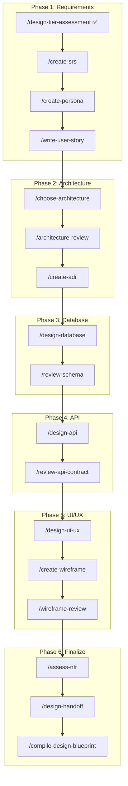

# Design Tier Assessment Result

**Project:** IM Tech Company Profile + Admin Dashboard
**Date:** 2026-01-14 | **Workflow:** WF-D00

---

## 🎯 Detected Tier: **Tier 2 - Team/Business**

### Rationale

| # | Question | Answer | Impact |
|---|----------|--------|--------|
| 1 | Solo/personal project? | ❌ No | Not Tier 1 |
| 2 | Dedicated design team? | ✅ Yes (Ali) | → Tier 2+ |
| 3 | Team size > 10? | ❌ No (7 members) | Tier 2 |
| 4 | Budget > $10,000? | ❌ No (Rp 0) | - |
| 5 | Budget > $50,000? | ❌ No | Not Tier 3 |
| 6 | Need ARB? | ❌ No | Not Tier 3 |
| 7 | Multiple platform integration? | ❌ No | Not Tier 3 |
| 8 | Regulatory/compliance? | ❌ No | Not Tier 3 |
| 9 | Enterprise security? | ❌ No | Not Tier 3 |
| 10 | Cross-team coordination? | ❌ No | Not Tier 3 |

### Tier Inheritance

| Phase | Tier | Reason |
|-------|------|--------|
| Planning | Tier 2 | Team project, 7 members |
| **Design** | **Tier 2** | ✅ Inherited - no significant changes |

---

## 📋 Applicable Rules

| ID | Rule Category | Status |
|----|---------------|--------|
| D01-D08 | Foundation Rules | ✅ **Mandatory** |
| D09-D13 | Team/Collaboration Rules | ✅ **Mandatory** |
| D14-D21 | Enterprise Rules | ❌ N/A |

### Foundation Rules (D01-D08) - MANDATORY

| ID | Rule | Required For |
|----|------|--------------|
| D01 | ERD First | Database design |
| D02 | Normalize to 3NF | Schema normalization |
| D03 | Index FK | Query performance |
| D04 | Type Safety | Data integrity |
| D05 | API Versioning | API design |
| D06 | Response Envelope | API consistency |
| D07 | Mobile-First | UI/UX design |
| D08 | Design Tokens | Style consistency |

### Team Rules (D09-D13) - MANDATORY

| ID | Rule | Required For |
|----|------|--------------|
| D09 | SRS Before Development | Requirements doc |
| D10 | Acceptance Criteria (Gherkin) | User stories |
| D11 | C4 Diagrams (L1+L2) | Architecture docs |
| D12 | OpenAPI First | API contract |
| D13 | Peer Review | All design decisions |

---

## 📂 Applicable Workflows

| Category | Workflows | Status |
|----------|-----------|--------|
| **design_solo** | 8 workflows | ✅ Required |
| **design_team** | 10 workflows | ✅ Required |
| design_enterprise | 5 workflows | ❌ N/A |
| design_security | 13 workflows | ⚠️ Partial (basic auth) |

### Solo Workflows (design_solo) - REQUIRED

| ID | Workflow | Purpose | Priority |
|----|----------|---------|----------|
| WF-D01 | `/choose-architecture` | Select architecture pattern | 1 |
| WF-D02 | `/design-database` | ERD + Schema design | 2 |
| WF-D03 | `/design-api` | OpenAPI specification | 3 |
| WF-D04 | `/design-ui-ux` | UI/UX guidelines | 4 |
| WF-D05 | `/create-wireframe` | Wireframe creation | 5 |
| WF-D06 | `/create-adr` | Architecture decisions | As needed |
| WF-D07 | `/assess-nfr` | Non-functional requirements | 6 |
| WF-D08 | `/compile-design-blueprint` | Design handoff doc | 7 |

### Team Workflows (design_team) - REQUIRED

| ID | Workflow | Purpose | Priority |
|----|----------|---------|----------|
| WF-DT01 | `/create-srs` | Software Requirements Spec | **1 (FIRST)** |
| WF-DT02 | `/create-persona` | User personas | 2 |
| WF-DT03 | `/write-user-story` | User stories with AC | 3 |
| WF-DT04 | `/review-specs` | Spec peer review | After specs |
| WF-DT05 | `/review-schema` | Schema peer review | After DB design |
| WF-DT06 | `/review-api-contract` | API contract review | After API design |
| WF-DT07 | `/architecture-review` | Architecture peer review | After arch decision |
| WF-DT08 | `/wireframe-review` | Wireframe peer review | After wireframes |
| WF-DT09 | `/assess-nfr` | NFR assessment | After architecture |
| WF-DT10 | `/design-handoff` | Developer handoff | Before development |

---

## 🛤️ Recommended Workflow Path



### Simplified Path

```
/create-srs → /create-persona → /write-user-story → /choose-architecture → /design-database → /design-api → /design-ui-ux → /create-wireframe → /compile-design-blueprint
```

---

## ✅ Action Items

| # | Action | Owner | Next Step |
|---|--------|-------|-----------|
| 1 | Run `/create-srs` | AI + Tataq | **NOW** |
| 2 | Create user personas | Ali | After SRS |
| 3 | Write user stories | Tataq + Ali | After personas |
| 4 | Choose architecture pattern | Mifdal + Fachri | After requirements |

---

## 📚 Prerequisites Verified

| Document | Status | Location |
|----------|--------|----------|
| Project Charter | ✅ Available | `planning_project_charter.md` |
| Tech Stack Decision | ✅ Available | `planning_tech_decision.md` |
| Planning Tier Result | ✅ Tier 2 | `planning_blueprint.md` |
| Planning Blueprint | ✅ Available | `planning_blueprint.md` |

---

## 🚀 Next Step

```bash
# Run SRS creation workflow
/create-srs
```

**Why SRS First?**
- Tier 2 WAJIB memiliki SRS document sebelum design (RULE-P02)
- SRS akan menjadi foundation untuk semua design decisions
- User stories dan acceptance criteria akan based on SRS

---

*Generated: 2026-01-14 13:00*
*Workflow: /design-tier-assessment | ID: WF-D00*
